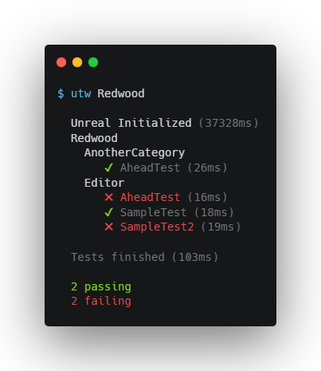

# Unreal Test Wrapper (utw)

utw is a simple terminal script inspired by popular NodeJS testing frameworks to provide easy to read output for running tests for Unreal Engine applications.

## Install

1. Install [NodeJS](https://nodejs.org)
1. `npm install --global utw`

## About

utm runs the [below command](#command), parses the `UE_LOG` output, and prints an output to the terminal with the status of each of the tests.



There is preliminary, untested support for Mac, but Linux is not supported currently (PRs are welcome!).

### Command

```
UnrealEditor.exe
  YourProject.uproject
  -ExecCmds=Automation RunTests <test-pattern>;Quit
  -stdout
  -FullStdOutLogOutput
  -Unattended
  -NoPause
  -NoSplash
  -NoSound
  -NullRHI
```

## Usage

Run `utm <test-pattern>` in the Unreal project directory (where the `uproject` file is located).

`<test-pattern>` gets passed to `-ExecCmds=Automation RunTests <test-pattern>`. For example if you have `IMPLEMENT_SIMPLE_AUTOMATION_TEST(FSampleTest, "Sample.Test1", ...)`, a `<test-pattern>` of `Sample` will match all tests that start with the `Sample` category (i.e. `Sample.Test1`, `Sample.Test2`, etc).

```
Usage: utw [options] <test-pattern>

Unreal Test Wrapper is a script that bootstraps and beautifies Unreal tests. Call from the directory

Arguments:
  test-pattern                                    The test pattern to use for Unreal Automation

Options:
  -V, --version                                   output the version number
  -b --build-configuration <build-configuration>  The build configuration to use (Debug, DebugGame, Development, Test, Shipping; default: Development) (default: "Development")
  --engine-dir <engine-dir>                       Path to the base of the Unreal Engine installation to use.
  --no-color                                      Disable colorized output
  -h, --help                                      display help for command
```
